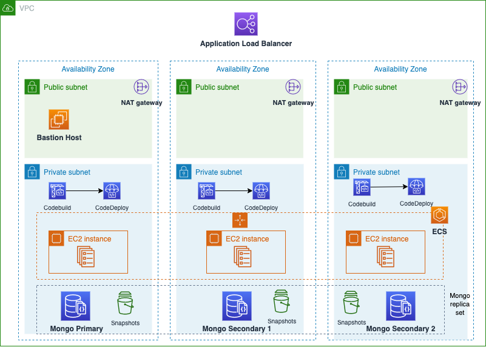

# Cloud Phoenix architecture

This Terraform project will automatically provision the following environment on AWS:

- A virtual private cloud (VPC) configured with public and private subnets across three Availability Zones.
- In the public subnets, NAT gateways allow outbound internet connectivity for resources in the private subnets.
- In the public subnets, a bastion host allows inbound Secure Shell (SSH) access from a predefined list of IP addresses.
- An Applicaton Load balancer exposes the Phoenix app to the internet.
- In the private subnets, there is a MongoDB cluster of three replicas. During the setup process, it creates three users:
    - the **admin** user
    - the **user** used by the phoenix app
    - the **test user** used by CodeBuild to run the test phase.
- In the private subnets, it's provisioned the ECS cluster, with an capacity provisioner that adds up to three instances to the cluster according with the CPU and memory consumption. The Phoenix task-definition, instead, is scaled up to three copies according with the RequestCountPerTarget metric.
- In the private subnets, it's provisioned the CodePipeline project too.
- The two database connection strings are saved in the **SSM Parameter Store**