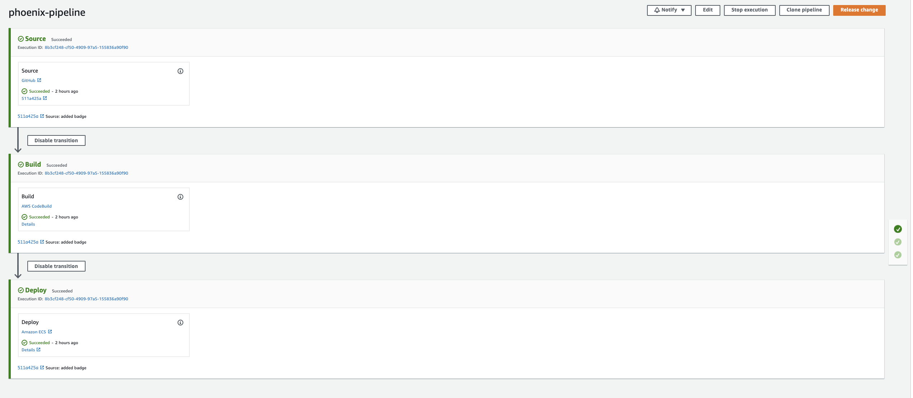

# CI/CD Pipeline



The continuous integration/delivery pipeline has been implemented through the AWS **CodePipeline** service. The project is automatically provisioned by the `cicd_pipeline` Terraform module.

The project has three stages:

1. **Source**: The Pipeline is triggered by a commit on a `master` branch of the *cloud-phoenix-kata* repository.
2. **Build**: The build process performs the actions depicted by the below `buildspec.yml`

```yml
version: 0.2
phases:
  install:
    commands:
       - npm install
  pre_build:
    commands:
        - npm test
        - eval $(aws ecr get-login --region $AWS_DEFAULT_REGION --no-include-email)
        - BUILD_ID=$(echo $CODEBUILD_BUILD_ID | cut -d ':' -f 2)
  build:
    commands:
       - docker build -t $NAME:$BUILD_ID --build-arg NODE_ENV=production .
       - docker tag $NAME:$BUILD_ID $REGISTRY_URL/$NAME:$BUILD_ID
       - docker tag $NAME:$BUILD_ID $REGISTRY_URL/$NAME:latest
  post_build:
    commands:
       - docker push $REGISTRY_URL/$NAME
       - echo Writing image definitions file...
       - printf '[{"name":"%s","imageUri":"%s"}]' $NAME $REGISTRY_URL/$NAME:$BUILD_ID > imagedefinitions.json
artifacts:
  files: imagedefinitions.json
```

- In the `pre_build` phase, it's run the test-suite and it's retrieved the ecr credentialis.
- In the `build` phase, it's build the container, by passing the `NODE_ENV=production` argument
- In the `post_build` phase, the image is pushed on ECS and it's created an artifact that will be passed to the third and last phase of the pipeline

3. **Deploy**: The deploy process, updates the phoenix service with a task-definition that has the updated docker image.