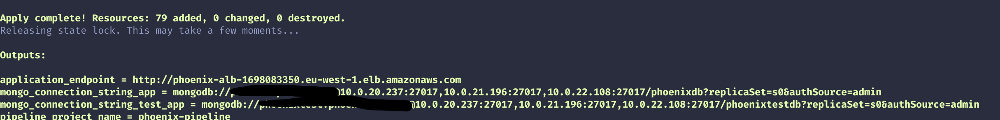

# Bootstrap Phoenix infrastructure

In this project you can find the [Terraform](https://www.terraform.io/) scripts to provision a production ready infrastructure for the Cloud Phoenix Kata application.

## Instructions

### Support Services

Before running the Terraform project, you need to provision some services required by the Terraform itself. In particular:

- A **DynamoDB Table**, required to manage the state lock and preventing other memembers of the team from acquiring the lock and potentially corrupting the state during the write operations.
- A **S3 bucket**, required to save the state in a *remote* location so it can be shared between all members of the team.
- A **ECR repository**, required to store the Phoenix app Docker image. With the repsitory is created a lifecycle policy which deletes the images older than 7 days.

You can find these services in the `support-svc` folder and you have to define the following Terraform variables:

| Variable Name | Description | Default Value |
| ------------- | ----------- | ------------- |
| `aws_profile` | Your AWS cli profile name | - |
| `aws_region`  | The AWS region where provision the services | **eu-west-1** |
| `app_name` | The name of your application and repository | **phoenix** |

After defining the above variables, run the following commands in the `support-svc` folder to provision the services:

```bash
$ terraform init
$ terraform plan
$ terraform apply
```

After the execution, the names of the resources generated and the URL of the ECR repository will be printed as output.
With this output, you have to create a file inside the `phoenix-tf` folder named **terraform.tf**, with the following content:

```terraform
terraform {
  required_version = ">= 0.12.0"

  backend "s3" {
    bucket  = ""
    dynamodb_table = ""
    key     = "phoenix.tfstate"
    encrypt = true
    region  = ""
    profile = ""
  }
}
```
where:
- **bucket**: add as value the output `s3_remote_state_bucket` of the `support-svc` project
- **dynamodb_table**: add as value the output `phoenix-terraform-state-locking` of the `support-svc` project
- **region**: add the same region specified in the `support-svc` project
- **profile**: add the same value specified in the `support-svc` project

### Phoenix infrastructure

This project will provision the infrastructure outlined in the [architecture section](architecture.md) of this README.

You have to dfined the following variables:

| Variable name | Description | Default value |
| ------------- | ----------- | ------------- |
| `aws_profile` | Your AWS cli profile name | - |
| `aws_region`  | The AWS region where provision the infrastructure | **eu-west-1** |
| `app_name` | The name of your application and repository | **phoenix** |
| `aws_key_pair_name` | The key pair name | - |
| `aws_public_key_path` | The path on your local pc where is stored the public key | - |
| `aws_private_key_path` | The path on your local pc where is stored the private key | - |
| `ips_bastion_source` | A list of ip addresses. You will be able to connect to the bastion host only from these addresses | - |
| `notification_email` | The email address used to notify the scaling actions | - |
| `docker_repo_url` | The base url of the ECR repository, **without the image name**. It's the ouput of the Support Services above | - |
| `image_name` | The Docker image name. It's the last part of the ECR repository URL printed by the Support Services project above | - | 
| `github_repo` | The URL of the GitHub repository where the Phoenix Kata application source code is located. It's required by the Pipeline module | - | 
| `github_oauth_token` | A valid [GitHub Personal access token](https://help.github.com/en/github/authenticating-to-github/creating-a-personal-access-token-for-the-command-line) with the permissions to access to the Phoenix Kata application repo.  | - | 
| `github_owner` | The owner name of the GitHub repository. It's required by CodePipeline | - | 
| `github_repo_name` | The name of the GitHub repository. It's required by CodePipeline | - |

**N.B.** The Terraform CodePipeline module required you to define the **GITHUB TOKEN** as environment variable before executing the project:

```bash
$ export GITHUB_TOKEN=your_github_personal_access_token
```

After defining the above variables, run the following commands in the `phoenix-tf` folder to provision the services:

```bash
$ terraform init
$ terraform plan
$ terraform apply
```
The output will be something like this:



### HTTPS support

This project provision an Application Load Balancer listener on the port **80** by default. If you want to provision a listener on the port **443**, you have to:

- Define the variable `ssl` and setting it to **1**
- Define the variable `backend_certificate` and provide the ARN of a valid **ACM certificate**


### Clean resources

Run the following commands to tear-down the infrastructure:

```bash
$ terraform destroy --force
```
